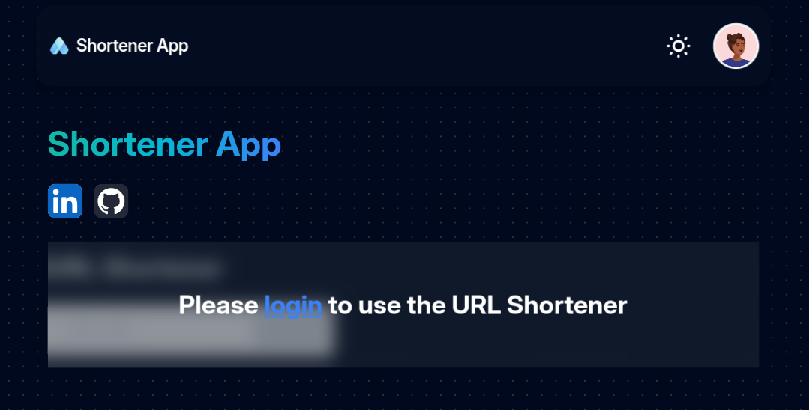

# URL Shortener Client

Este es un acortador de URL que permite acortar una URL larga y guardarla en una base de datos. La aplicación está hecha con Remix y se conecta a un servidor hecho con FastaAPI.

Este repositorio contiene el cliente de la aplicación. El servidor se encuentra en el siguiente repositorio: [URL Shortener Server](https://github.com/NachoBerridy/url-shortener-api/)





## Tech Stack


## Guía de instalación

### Development

Run the dev server:

```shellscript
npm run dev
```

### Deployment

First, build your app for production:

```sh
npm run build
```

Then run the app in production mode:

```sh
npm start
```

Now you'll need to pick a host to deploy it to.

#### DIY

If you're familiar with deploying Node applications, the built-in Remix app server is production-ready.

Make sure to deploy the output of `npm run build`

- `build/server`
- `build/client`